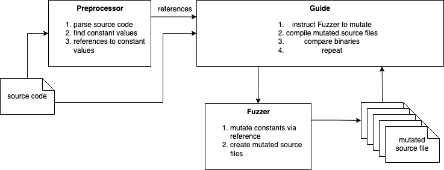
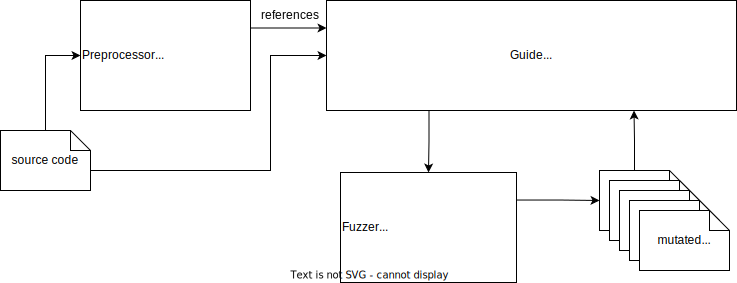

# Compiler Fuzzing via Guided Value Mutation

## Project description 
as in `/resources/project-topics.pdf`.

> Given a seed program, your target is to find a mutant of this program that causes large binary differences across two compilers. Specifically, your jobs would be 
> - (a) implementing an algorithm that promotes all constant values of a seed program to the input; 
> - (b) designing a fuzzer that mutates a seed program, i.e., how to mutate the constant values; 
> - (c) designing a guidance algorithm for the fuzzer to effectively find mutants that meet our need, i.e., large binary differences.
>
>This project will not require any prior knowledge about compilers, but need a good implementation skills. You can choose any programming languages, python, however, is preferred.
>
> **Advisor**: Shaohua Li - shaohua.li@inf.ethz.ch (https://shao-hua-li.github.io/)

## Working resources and links

- Overleaf: https://www.overleaf.com/project/640f49e2f89087f866b425bb  
- ACM Template: https://www.acm.org/publications/proceedings-template
- pycparser: https://github.com/eliben/pycparser
- AFL++ (GitHub): https://github.com/AFLplusplus/AFLplusplus
- AFL++ (Website): https://aflplus.plus/
- AFL++ (Paper): https://www.usenix.org/conference/woot20/presentation/fioraldi
- What is fuzzing (Tutorial): https://github.com/alex-maleno/Fuzzing-Module

## Solution Architecture

## Proposal
We mutate constant values of a seed program to create valid and runnable, but semantically different, mutants. The
goal is to find large differences in number of assembly instructions produced by two different GCC compiler versions.
We expect that newer compiler versions should not generate significantly more assembly instructions under the same
compiler flags. Faster code not always uses less lines of assembly, see loop unrolling or inlining, but large line differences
can give a hint that at least it’s an interesting case to investigate.
In the course of this project, we will implement a pipeline in Python that parses a seed program and sequentially
generates mutants, compiles them, and compares the generated assembly output. In a first phase, we mutate the constant
values randomly. In a second phase, we mutate the values guided by discrete Bayesian optimisation. We aim to
efficiently find the mutant with the largest difference in assembly instructions, as the compilation time is costly

### Architecture
<!--  -->

### Timeline
 - April 16th: Gather source code for seed programs and implement base pipeline
 - April 23rd: Evaluate seed programs with random value mutation
 - May 7th: Implement guiding algorithm
 - May 14th: Evaluate seed programs with guided value mutation
 - June 6th: Final report and buffer time

## Deadlines
Slightly rephrased version of guidelines (`/resources/guidelines-for-proposals-reports.pdf`)

### Progress Report (30.04.)
1-page report
1. Describe your progress
2. What have you done so far?
3. What remains?
4. What is your plan for the rest of the project?

### Final report (06.06.)
A final report (as a conference-style paper) to describe what we have achieved.
1. Abstract: about 200-word summary of the project
2. Introduction:
    - Describe and motivate the problem
    - High-level overview of the approach
    - Summarized our results
    - Stress what is novel about the work
3. Approach:
    - detailed description of our approach
    - Highlight the main technical difficulties and novelties
4. Implementation and results:
    - if appropriate, describe out implementation and experimental results
    - explain how to interpret the numbers and results if applicable
5. Related work:
    - detailed discussion of related work
    - stress how these efforts relate to our work
    - **avoid** simply listing and describing what other people did
6. Conclusion:
    - summarize the work again
    - discuss limitations and possible future work
7. References: list the papers that we have cited

